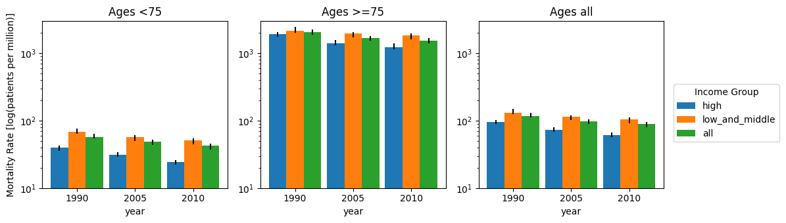

# Homework 1

## Question 1: Make a graph of the mortality values

## Question 2: Discuss your design choices. (Why did you chose this particular graph?)
When deciding between the graphs I wanted a visualization that ensured the following elements were put on display:
1. Datapoints were easily comparable, including for people with potential color-blindness or color-sensitivity constraints.
2. Datapoints are displayed in a manner that describes meaningful order between each category being shown.
3. Error in measurements is easy to quantify with a glance.
4. Hypotheses and claims of the original paper can be verified in less than 5 seconds.
5. Datapoitns are logically grouped together.
6. Elements of time are preserved

Visualizations Considered:
1. Scatter plot: The X and Y axes could represent the magnitudes of a given measurement for rich and poor countries respectively. This would support the wealth hypotheses put forward by the paper. That said, the graph would look too cluttered and likely require a very lengthy legend. **Ruled out**
2. Line graph: The data does belong to 3 temporally linked groups, but the distance between these timepoints is inconsistent such that the final evalution would require irregularly spaced x tick-labels. This isn't a major problem, but I feel that with so few timepoints there are other better options **Ruled out**
3. Heatmap: Measure of error not easily visible in this visualization, that is one of our requirements so... **Ruled out**
4. Bar chart(s): Measure of error can be displayed with error bars, certainty of differences proposed in the hypotheses can be verified in the difference in heights between charts. *Strong Contender*
5. Radar chart: Not enough axes of comparison, though something worth considering if we have a lot of different data points **Ruled out**

Decision: **Bar Chart(s)**

In making the bar charts I wanted to ensure that we could clearly understand which datapoints we were looking at based on consistent display patterns. As such I employed the following heirarchy. Separate plots for age group, that way age-group-specific differences were clear and easy to see. The plot boundary could have been removed, but I feel that keeping it together made the differences betweent he age groups much clearer. Separate bar group clusters along the x axis based on timepoint. This allowed us to maintain the relative time ordering of each estimator in a given plot. By stacking these along the X axis we could also use the y axis for our estimator. I did this so that we could have a shared Y axis for comparison between the age groups. Ultimately due to differences in scale, I opted to use a log-scale for the y-axis. While this harms the visability of the exact numbers, the general trends, differences in heights of the bars, is still very clear. Finally, I separated wealth levels by color. As I felt that wealth discrepancies were the most important point the paper was trying to make, thus to address this I wanted to make sure the wealth level stratifications were kept as close to each other as possible, so I opted to separate those by color. I used matplotlib's high contrast color palette to facilitate this and ensure that three colors that pass red-green colorblindness and monochrome colorblindeness tests were selected. These colors do not pass blue-green colorblindness tests; however, the legend's order matches the bar's order and the blue and green colors are separated by orange. Finally to make error differences clear, I included error bars on the bargraphs. The final result is a composite figure that groups elements together in a heirarchical and comparable fashion such that the major points of the paper regarding wealth, age, and mortality rate are easily drawn from the figure itself.

Note: I decided to add the aggregate groups so that it would be easier to visualize the total study population baseline. I mulled on this for a bit, so I can definitely see arguments for excluding the aggregate "All" groups wholesale.

## How would you make a comprehensive graph that includes all of the information in the table (the additional outcomes incidence, prevalence, MIR, and DALYs lost)?
When trying to include many distinct measurement groups simultaneously, the bar chart quickly becomes clutered and often demands to many rows to display each of the metrics collected. To accomodate this, we need a figure with multiple dimensions that can be quickly viewed to observe the differences between each measurement. To accomodate this I propose a summary visualization in the form of a radar chart. Radar charts make the visualization of multiple dimensions of data simultaneously much easier (Example below). With that said, they often run into problems as the line implies some level of connection between the distinct types that may not actually exist. Personally, I think that shortcoming can be cast aside as on some level the relationships between these measurements is what our hypothesis seeks to explain. Unfortunately given the amount of information we need to display, we will likely need 6 radar plots. 1 for each timepoint-age group pairing. Additionally, we will need 2 lines on each radar plot, one for wealthy countries and one for poorer countries. Notably, we are excluding the aggregate measure this time, I feel that it would make the graph too clutered. Error could be represented as a lightly shaded circle around each measurement allowing for accurate comparison of each metric with a simple view. With all these features, this could make the figure as whole feel a bit busy, but to address this we could focus less on the time component, allowing us to narrow this down to two distinct radar plots for each age group instead! All in all, I like the idea of radar plots for showing the differences between many metrics simultaneously.

Radar plots are a summary graph, and thus don't really represent the actual quantities for each metric very well. Often scales on each axis aren't included. We will likely avoid including the scale as well as the hypothesis is more concerned with showing the differences between measurements rather than the quantified differences. Additionally those quantities could be included discretely in a supplementary table.

## Appendix
Visualization code: See VisualizationCode.py for the python code used to generate this figure
